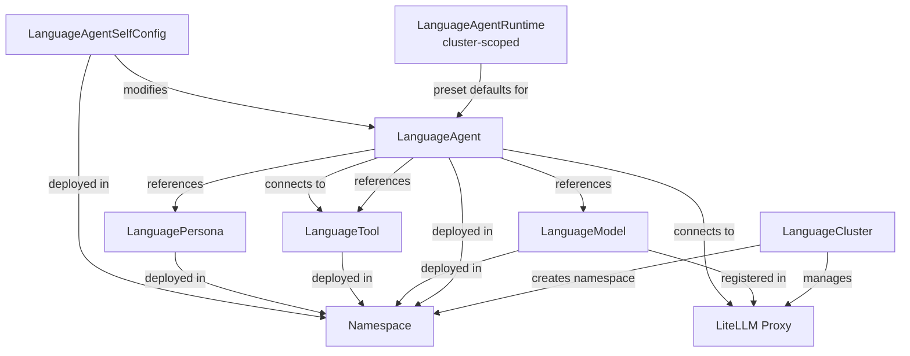

# CRD Reference Overview

Language Operator provides seven Custom Resource Definitions (CRDs) for managing AI agent workloads on Kubernetes.

!!! tip "Auto-Generated API Reference"
    See the **[Complete API Reference](reference.md)** for auto-generated field documentation from Go types.
    This reference updates automatically when CRD types are modified.

## Core Resources

### LanguageCluster

**Scope:** Cluster
**Purpose:** Managed namespace for AI clusters

A `LanguageCluster` creates an isolated environment for agents, models, and tools with:

- Dedicated namespace
- Shared LiteLLM proxy for all models
- Optional external ingress
- NetworkPolicy enforcement

**Common Use Cases:**

- Multi-tenant agent deployments
- Environment separation (dev/staging/prod)
- Team or project isolation

[Full LanguageCluster Reference →](languagecluster.md)

---

### LanguageAgent

**Scope:** Namespace
**Purpose:** AI agents running as Kubernetes workloads

A `LanguageAgent` represents an AI agent running as a Kubernetes workload with:

- Container image specification
- Model, tool, and persona references
- Configuration injection
- Workspace storage

**Common Use Cases:**

- Deploying AI assistants (OpenClaw, etc.)
- Scheduled automation tasks
- Interactive agent services
- Multi-agent systems

[Full LanguageAgent Reference →](languageagent.md)

---

### LanguageModel

**Scope:** Namespace
**Purpose:** LLM endpoint configuration

A `LanguageModel` configures access to a large language model through a managed LiteLLM proxy:

- Provider abstraction (Anthropic, OpenAI, Azure, etc.)
- Credential management
- Rate limiting and retry policies
- Cost tracking
- Regional endpoints

**Common Use Cases:**

- Claude, GPT-4, or other commercial models
- Self-hosted models (Ollama, vLLM)
- Azure OpenAI deployments
- Multi-region failover

[Full LanguageModel Reference →](languagemodel.md)

---

### LanguageTool

**Scope:** Namespace
**Purpose:** MCP-compatible tool servers

A `LanguageTool` deploys a Model Context Protocol (MCP) tool server that extends agent capabilities:

- Standalone service or per-agent sidecar
- Automatic endpoint injection
- Tool schema discovery
- Network egress policies

**Common Use Cases:**

- Web search (Brave, Google)
- Email and calendar integration
- Database query tools
- Custom business logic

[Full LanguageTool Reference →](languagetool.md)

---

### LanguageAgentRuntime

**Scope:** Cluster
**Purpose:** Reusable agent preset (image, port, init containers, probes, env vars)

A `LanguageAgentRuntime` is a cluster-scoped template that packages everything needed to run a specific agent type. Admins install runtimes once; users reference them by name:

```yaml
spec:
  runtime: openclaw
```

The standard runtimes (`openclaw`, `opencode`) are bundled with the Helm chart and installed automatically.

**Common Use Cases:**

- Standardize agent images and configuration across teams
- Pre-package complex init container patterns (adapters, sidecars)
- Version-control runtime defaults separately from agent configuration

---

### LanguageAgentSelfConfig

**Scope:** Namespace
**Purpose:** Runtime self-modification requests submitted by agent pods

A `LanguageAgentSelfConfig` (`lasc`) is a short-lived, namespace-scoped resource that an agent pod submits to request changes to its own `LanguageAgent` spec at runtime. The controller validates the request against the parent agent's `spec.selfConfigure` allowlist before applying the patch.

**Common Use Cases:**

- Agents dynamically adding tools they discover at runtime
- Agents injecting new environment variables without a full redeploy
- Agents updating their own system instructions mid-session

[Full LanguageAgentSelfConfig Reference →](languageagentselfconfig.md)

---

### LanguagePersona

**Scope:** Namespace
**Purpose:** Reusable behavioral templates

A `LanguagePersona` defines reusable personality and instruction templates:

- `tone` — communication style (e.g. professional, casual, technical)
- `personality` — character traits and reasoning style
- `expertise` — domain knowledge and specialization

**Common Use Cases:**

- Consistent brand voice across agents
- Role-based agent templates (analyst, writer, coder)
- Compliance and safety constraints
- A/B testing behavioral variants

[Full LanguagePersona Reference →](languagepersona.md)

---

## Resource Relationships



## Configuration Injection

The operator automatically injects configuration into agent pods:

| Injection | Source | Location |
|-----------|--------|----------|
| Instructions | `spec.instructions` (inline string) | Embedded in `/etc/agent/config.yaml` under `instructions:` key |
| Config | Assembled from personas, models, tools | `/etc/agent/config.yaml` |
| Model Endpoint | Shared proxy URL | `MODEL_ENDPOINT` env var |
| Model Names | All `models` | `LLM_MODEL` env var |
| Tool Endpoints | All `tools` | `MCP_SERVERS` env var |
| Agent Identity | Metadata | `AGENT_NAME`, `AGENT_NAMESPACE`, etc. |

See [Agent Runtime Contract](../components/agents.md) for complete injection spec.

## API Versions

All CRDs use API version `langop.io/v1alpha1`.

!!! warning "Alpha API"
    The v1alpha1 API is subject to breaking changes. Pin your Helm chart version and review release notes before upgrading.

## Common Patterns

### Namespace Scope

All references (`models`, `tools`, `personas`) are namespace-scoped — a `LanguageAgent` can only reference resources in the same namespace. Deploy shared resources (models, tools) into each namespace that needs them, or use the `LanguageCluster` to manage a shared namespace boundary.

### Multiple References

Agents can reference multiple models, tools, or personas:

```yaml
spec:
  models:
    - name: claude-sonnet
    - name: claude-haiku
  tools:
    - name: web-search
    - name: email-client
  persona: base-assistant
```

The operator merges all referenced configurations.

### Conditional Status

Most resources follow Kubernetes conventions for status conditions:

```yaml
status:
  phase: Running  # or Pending, Failed
  conditions:
    - type: Ready
      status: "True"
      reason: ReconcileSuccess
      message: All child resources created successfully
```

`LanguageAgentRuntime` is an exception — it is a static config preset (analogous to `IngressClass` or `StorageClass`) and has no status subresource.
